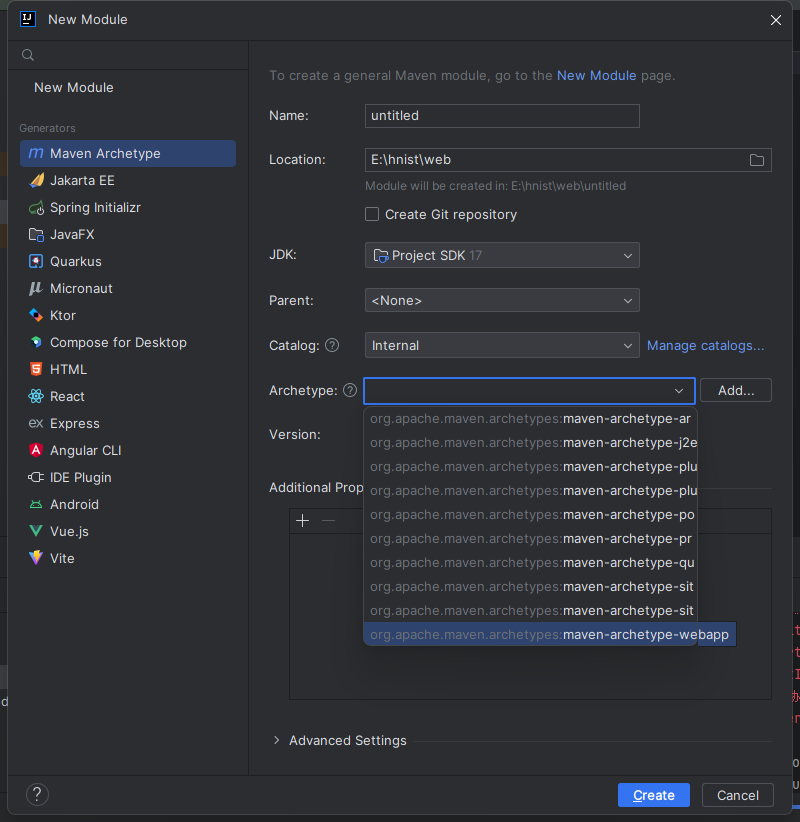
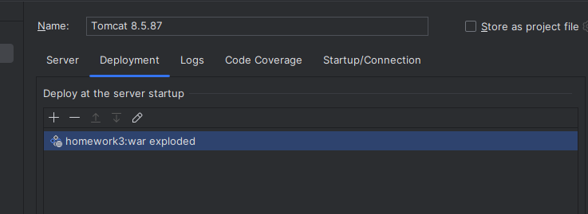
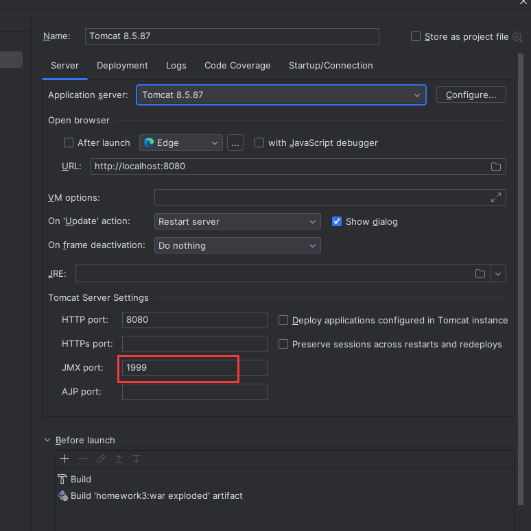
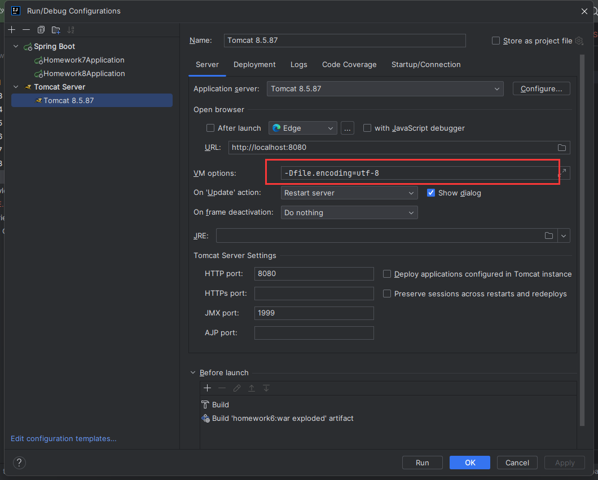

## IDEA 运行 servlet 项目的配置

通过 maven 的 webapp 选项创建 jsp 项目



tomcat 配置一步




启动报错 1099 被占用，换如下端口



而 8080 被占用，重启

## 乱码

在运行配置界面加上如下一句话



## springboot 静态资源

默认情况下，以下目录为默认的静态资源查找目录。其中的静态资源可以被直接访问：

- `classpath:/META-INF/resources/`
- `classpath:/resources/`
- `classpath:/static/`
- `classpath:/public/`
- `${user.dir}/public/` （程序运行目录下的 public 目录）

静态资源默认 url 访问路径为 `/**`，访问时路径注意带上文件夹

以上两个路径可以通过配置文件修改：

```properties
# 静态资源的访问路径
spring.mvc.static-path-pattern=/**
# 静态资源的目录
spring.web.resources.static-locations[0]=classpath:/public
```